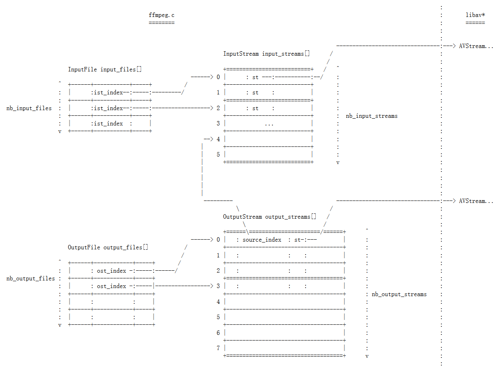
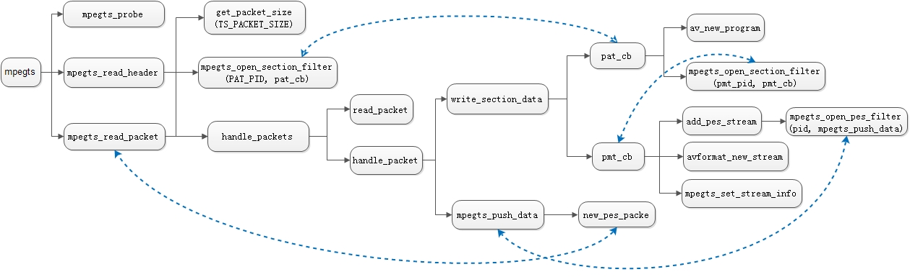
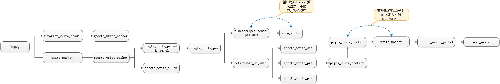
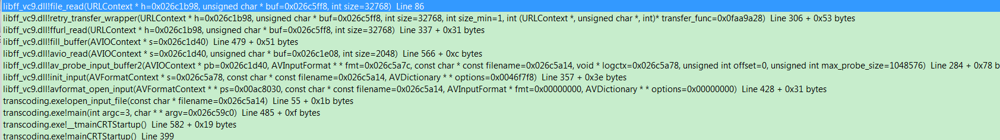

FFMpeg代码分析学习记录

流程图
======


ffmpeg.c
========



av\_probe\_input\_format-\>av\_probe\_input\_format2-\>av\_probe\_input\_format3

av\_probe\_input\_buffer-\>av\_probe\_input\_buffer2

av\_get\_frame\_filename-\>av\_get\_frame\_filename2

ffplay.c
========

mp4中关于h264和aac的说明
========================

   
 mp4的stsd原子中包含很多关键的音视频编解码元信息。对于视频数据，不同的编解码格式stsd中包含的子原子类型是不同的。MP4的视频
H.264封装有2种格式：h264和avc1，只要看到这两个FOURCC（四字节编码）。就可以肯定是h.264编码，区别在于slice是否有起始
码。对于音频数据，stsd中包含的子原子只会是mp4a，mp4a又包含了一个子原子esds，判断音频编码格式的是esds中的第十一个字节，如果是
0x40则说明是aac编码，如果是0x69则说明是mp3。

-   AVC1 描述:H.264 bitstream without start
    codes.一般通过ffmpeg转码生成的视频，是不带起始码0×00000001的，但是带有4字节的长度。

-   H264 描述:H.264 bitstream with start
    codes.一般对于一下HDVD等电影的压制格式，是带有起始码0×00000001的。

     除了avc1和h264还可能是下面的FOURCC，只是名字不同而已。

-   MEDIASUBTYPE\_AVC1 'AVC1' H.264 bitstream without start codes.

-   MEDIASUBTYPE\_H264 'H264' H.264 bitstream with start codes.

-   MEDIASUBTYPE\_h264 'h264' Equivalent to MEDIASUBTYPE\_H264, with a different
    FOURCC.

-   MEDIASUBTYPE\_X264 'X264' Equivalent to MEDIASUBTYPE\_H264, with a different
    FOURCC.

-   MEDIASUBTYPE\_x264 'x264' Equivalent to MEDIASUBTYPE\_H264, with a different
    FOURCC.

FFMpeg支持SDI采集卡
===================

1. 驱动安装成功  
decklink Studio 4K  
ubuntu 14.04  
下载相关驱动  
需要安装dkms软件  
2. ffmpeg中已经可以调用decklink  
使用如下命令可以调用decklink：  
./ffmpeg -f decklink -i 'DeckLink Studio 4K\@11' -c:v libx264 -c:a aac a.ts -y

3. 需要调研使用何种设备可以测试declink  
比如什么设备可以输入SDI，什么设备可以接收SDI

SDI输入方式，现在调研来看，可能的方案：  
1. 使用转接口  
将VGA转为SDI  
2. 使用SDI摄像机  
网上查看了一下，有一些比较便宜的摄像机，可以用作SDI输入

1.
ffmpeg3.0.2中对decklink的支持选项较少，重新在ffmpeg3.2.2中加入decklink进行编译。  
2.
从笔记本或华为盒子输出HDMI信号，然后通过转接口转为SDI信号，但是使用ffmpeg进行抓取没有发现SDI信号。  
直接采用HDMI信号也没有抓取到，可能抓取的方式有问题，需要继续调研测试。

在转码器中输出了一些debug信息。  
根据转码器的输出，仍然是转码器没有检测到输入信号，然后就是用彩条进行输出了。  
可能是转换器到采集卡之前出了问题，需要验证从转换器出是否有信号输出。

使用相机可以捕捉到信号  
Blackmagic Desktop Video显示出当前可以使用的信号  
使用SDK中的Capture程序可以捕捉到信号  
模式要选对，对于相机所使用的模式是11,对于hdmi转SDI，使用模式是4  
使用转接口的信号时有时无，不知道是不是转接口问题.

使用DeckLink Studio
4K进行输入时，不论HDMI输入还是SDI输入，都需要设置准确相应的模式，这样才能争取的捕捉到信号，否则设备初始化失败，容易导致捕捉不到信号。

DeckLinke Sudio 4K支持的具体模式如下：

1 NTSC 720 x 486 29.97 FPS

2 PAL 720 x 576 25 FPS

3 1080p23.98 1920 x 1080 23.976 FPS

4 1080p24 1920 x 1080 24 FPS

5 1080p25 1920 x 1080 25 FPS

6 1080p29.97 1920 x 1080 29.97 FPS

7 1080p30 1920 x 1080 30 FPS

8 1080i50 1920 x 1080 25 FPS

9 1080i59.94 1920 x 1080 29.97 FPS

10 1080i60 1920 x 1080 30 FPS

11 1080p50 1920 x 1080 50 FPS

12 1080p59.94 1920 x 1080 59.9401 FPS

13 1080p60 1920 x 1080 60 FPS

14 720p50 1280 x 720 50 FPS

15 720p59.94 1280 x 720 59.9401 FPS

16 720p60 1280 x 720 60 FPS

17 1080p23.98 DCI 2K 2048 x 1080 23.976 FPS

18 1080p24 DCI 2K 2048 x 1080 24 FPS

19 1080p25 DCI 2K 2048 x 1080 25 FPS

20 2160p23.98 3840 x 2160 23.976 FPS

21 2160p24 3840 x 2160 24 FPS

22 2160p25 3840 x 2160 25 FPS

23 2160p29.97 3840 x 2160 29.97 FPS

24 2160p30 3840 x 2160 30 FPS

25 2160p23.98 DCI 4K 4096 x 2160 23.976 FPS

26 2160p24 DCI 4K 4096 x 2160 24 FPS

27 2160p25 DCI 4K 4096 x 2160 25 FPS

可以使用Blackmagic Desktop Video
Setup工具可以看到相应的输入信号的格式，然后按照设备所支持的进行设置就可以了。

ffmpeg和ffplay相应的命令行如下：

ffplay -f decklink 'DeckLink Studio 4K\@11'

ffmpeg -f decklink -i 'DeckLink Studio 4K\@11' -c:v libx264 -c:a aac a.ts –y

SDI输入信号

1. SDI接口有三种类型，自动、SDI、HDMI

自动：可用检测出可用（有信号）的接口，也可以不进行检测，由引擎进行自动检测选择有信号的。

SDI/HDMI：这种情况下一般是SDI接口或HDMI接口都有信号，手动选择之后传给引擎，引擎根据该值进行设置。

为了支持上层传入的接口类型，引擎部分代码需要升级，加入相应的参数选择。

需要检测相应的设备名称，现在可用的信号（包括SDI或HDMI），可用信号的模式（分辨率、帧率）

引擎需要升级

Java后台也需要根据选择的流类型来使用不同的命令行：

1. 截图命令行

2. 编码命令行

hls解析
=======

discontinuity标签
-----------------

当前草案中还有EXT-X-DISCONTINUITY标签，它表征其后面的视频段文件和之前的不连续，这意味着文件格式、时间戳顺序、编码参数等的变
化。但是很遗憾，当前FFMPEG仍然不支持，这意味着该标签出现后，后续的PES中携带的dts和pts将重新从零开始计数。

int64\_t first\_timestamp;

int64\_t cur\_timestamp;

hls\_read\_packet函数中，会设置first\_timestamp
``` C
if (c-\>first\_timestamp == AV\_NOPTS\_VALUE &&

pls-\>pkt.dts != AV\_NOPTS\_VALUE)

c-\>first\_timestamp = av\_rescale\_q(pls-\>pkt.dts,

get\_timebase(pls), AV\_TIME\_BASE\_Q);
```

m3u8中ts切片长差别大带来的问题
------------------------------

m3u8中的ts片长差别比较大，比如m3u8的内容如下：

\#EXTM3U

\#EXT-X-VERSION:3

\#EXT-X-MEDIA-SEQUENCE:21239

\#EXT-X-TARGETDURATION:26

\#EXTINF:18.867,

vCIBNDYPD-21239.ts

\#EXTINF:10.733,

vCIBNDYPD-21240.ts

\#EXTINF:17.733,

vCIBNDYPD-21241.ts

\#EXTINF:26.067,

vCIBNDYPD-21242.ts

\#EXTINF:13.267,

vCIBNDYPD-21243.ts

\#EXTINF:7.933,

vCIBNDYPD-21244.ts

比如对于vCIBNDYPD-21242.ts，ffplay在播放的时候需要26s，而后面的2个ts片段的长度加起来才20s，

这会导致ffplay在播放完vCIBNDYPD-21242.ts之后再次获取m3u8时，最新的ts是vCIBNDYPD-21244.ts，而不是vCIBNDYPD-21243.ts。

而ffmpeg的策略是下载最新的ts（这样可以最大限度的跟上直播），这样ffmpeg会开始下载vCIBNDYPD-21244.ts，而错过vCIBNDYPD-21243.ts

导致出现skip问题。这带来的问题就是内容会丢失。

ffmpeg将hls推送为rtmp流时容易出现卡住问题
-----------------------------------------

av\_interleaved\_write\_frame(): Broken pipe

[flv \@ 0x2035f60] Failed to update header with correct duration.

[flv \@ 0x2035f60] Failed to update header with correct filesize.

Error writing trailer of rtmp://10.200.13.52:19350/live/hls\_rmtp\_test: Broken
pipe

ffmpeg转码hls时，出现切片失败情况，一直往一个文件中去写。

skipping 3 segments ahead, expired from playlists

我这边的理解是当前转码器刚刚播放的完的ts比刚刚拿到的m3u8中的第一个ts片段的编号要小，转码器的理解就是

1）broken pipe的字面意思是“管道破裂”。broken pip的原因是该管道的读端被关闭。

2）broken pipe经常发生socket关闭之后（或者其他的描述符关闭之后）的write操作中。

3）发生broken pipe错误时，进程收到SIGPIPE信号，默认动作是进程终止。

4）broken
pipe最直接的意思是：写入端出现的时候，另一端却休息或退出了，因此造成没有及时取走管道中的数据，从而系统异常退出；

hls播放时有时遇到如下问题：

skipping 1 segments ahead, expired from playlists

对应代码如下：

if (v-\>cur\_seq\_no \< v-\>start\_seq\_no) {

av\_log(NULL, AV\_LOG\_WARNING,

"skipping %d segments ahead, expired from playlists\\n",

v-\>start\_seq\_no - v-\>cur\_seq\_no);

v-\>cur\_seq\_no = v-\>start\_seq\_no;

}

udp不同步问题
=============

（2）udp源出现变化，只有一个图片（没有声音），导致不同步。

本地模拟：先推一个正常的udp源，然后再断掉，立即推一个图片源（没有声音），然后再换回原来的源，查看是否同步

filter机制
==========

滤镜相关

\-filter

\-vf -filter:v

\-af -filter:a

\-filter\_complex -lavfi

‐filter[:stream\_specifier] filtergraph (output,per‐stream)

Create the filtergraph specified by filtergraph and use it to filter the stream.

filtergraph is a description of the filtergraph to apply to the stream, and must
have a single input and a single output of the same type of the stream. In the
filtergraph, the input is

associated to the label in , and the output to the label out . See the
ffmpeg-filters manual for more information about the filtergraph syntax.

See the -filter\_complex option if you want to create filtergraphs with multiple
inputs and/or outputs.

avfilter\_graph\_parse-\> avfilter\_graph\_parse2

ffmpeg中mpegts的分析
====================

下图是mpegts\_read\_header函数的调用，涉及到了mpegts中的filter调用。

mpegts中的ts时长估计

1. 通过pts来估计

在函数estimate\_timings\_from\_pts中实现的，

2. 通过文件大小和码流来估计

在函数estimate\_timings\_from\_bit\_rate中实现的。

PCR 编码字段为 48bit，其中 6bit 为保留待用，其余 42bit
由基本字段和扩展字段组成。

对于第 i 位基本字段是以 90KHz 时钟周期为单位的编码 33bit，以
PCR\_base(i)表示；扩展字

段是以 27MHz 时钟周期为单位的编码为 9bit，以 PCR\_ext(i)表示。则 PCR 值表示为：

PCR(i)=PCR\_base(i)\*300+PCR\_ext(i)

式中，i 表示 PCR\_base(i)的末尾 bit 在 TS 流中的字节顺序号，不同序号的字节有着不
55

同的 PCR 值，也 PCR(i)/27M 就是编码器设定 i 字节到达解码器的时间。

参考《数字电视业务信息及其编码》一文中提到的PCR计算方法，

系统时钟频率以Hz为单位并需要满足一下条件

27 000 000 - 540 \<= 系统时钟频率 \<= 27 000 000 000 + 540

这里我们取系统时钟的理想值27 000 000 Hz

PCR分两部分编码：一个以系统时钟频率的 1/300
为单位，称PCR\_base；另一个以系统时钟频率为单位，成为PCR\_ext。

具体规定如下:

PCR\_base(i) = ((系统时钟频率 x t(i)) div 300) % 2\^33

PCR\_ext(i) = ((系统时钟频率 x t(i)) div 1) % 300

PCR(i) = PCR\_base(i) x 300 + PCR\_ext(i)

mpegts中pcr处理

读取pcr方法： parse\_pcr

写pcr：write\_pcr\_bits

pcr计算方法

| if (ts-\>mux\_rate \> 1) pcr = get\_pcr(ts, s-\>pb); else pcr = (dts - delay) \* 300;                                                                                                                                                                                         |
|-------------------------------------------------------------------------------------------------------------------------------------------------------------------------------------------------------------------------------------------------------------------------------|
| //+: calc pcr from stream size and stream rate static int64\_t get\_pcr(const MpegTSWrite \*ts, AVIOContext \*pb) { //+: time(s)=(pb+11)\*8/mux\_rate //+: pcr=time\*27MHz return av\_rescale(avio\_tell(pb) + 11, 8 \* PCR\_TIME\_BASE, ts-\>mux\_rate) + ts-\>first\_pcr; } |

Mpegts 解封装流程



mpegts 封装流程



TS流和PS流的区别：TS流的包结构是长度是固定的；PS流的包结构是可变长度的。这导致了TS流的**抵抗传输误码**的能力强于PS流（TS码流由于采用了固定长度的包结构，当传输误码破坏了某一TS包的同步信息时，接收机可在固定的位置检测它后面包中的同步信息，从而恢复同步，避免了信息丢失。而PS包由于长度是变化的，一旦某一
PS包的同步信息丢失，接收机无法确定下一包的同步位置，就会造成失步，导致严重的信息丢失。因此，在信道环境较为恶劣，传输误码较高时，一般采用TS码流；而在信道环境较好，传输误码较低时，一般采用PS码流。）

ffmpeg 2.7调试
==============

ffmpeg-2.7

write\_option

\-y -v trace -i "e:/test/angrybirds.ts" -filter\_complex
'[0:v]split=3[in1][in2][in3];[in1]rotate,scale=720x576[out1];[in2]fps=20[out2];[in3]yadif[out3]'
-map '[out1]' -c:v libx264 -fs 200M a.ts -map '[out2]' b.ts -map '[out3]' c.ts

transcoding调试

参数：e:/sequences/angrybirds.ts a.mp4

调用栈如下：




AAC音频解码错误警告
===================

使用如下命令进行转码：

lvtranscode -nhb -y -re -loop 1 -i /home/ubuntu/codec/release/res/duanliu.jpg -f
lavfi -i anullsrc=r=44100 -tune stillimage -pix\_fmt yuv420p -shortest -c:v
libx264 -preset superfast -level:v 5.1 -s 1280x720 -r 25 -x264-params
keyint=50:scenecut=0 -b:v 1072k -c:a aac -ac 2 -ar 44100 -b:a 128k -metadata
service\_provider=WONDERTEK -f flv rtmp://10.200.13.50:19350/live/duanliu

检测所推出的流，会报出如下错误：

[aac \@ 0x36307e0] Audio object type 3 is not implemented. Update your FFmpeg
version to the newest one from Git. If the problem still occurs, it means that
your file has a feature which has not been implemented.

解释：

First of, Object type 3 is AAC-SSR (It is defined in ISO 14496-3), And to the
best of my knowledge it is not supported in the ffmpeg deocoder.

采用上面的命令中的 libfaac进行音频编码的时候采用了音频 AAC的profile aac-ssr
，而ffmpeg没有支持 aac-ssr的解码，所以会报出错误，解决方法是编码的时候加上
-profile:a aac\_low

AAC

下面的一个音频信息支持是7声道：

Audio: dts (DTS-ES), 48000 Hz, 6.1, fltp, 768 kb/s (default)

转码为AAC时会报错：

Unsupported number of channels: 7

因为AAC最多支持6声道

/\* Channel map and unspecified bitrate guessing \*/

s-\>channels = avctx-\>channels;

ERROR\_IF(s-\>channels \> AAC\_MAX\_CHANNELS \|\| s-\>channels == 7,

"Unsupported number of channels: %d\\n", s-\>channels);

其中AAC\_MAX\_CHANNELS=8
